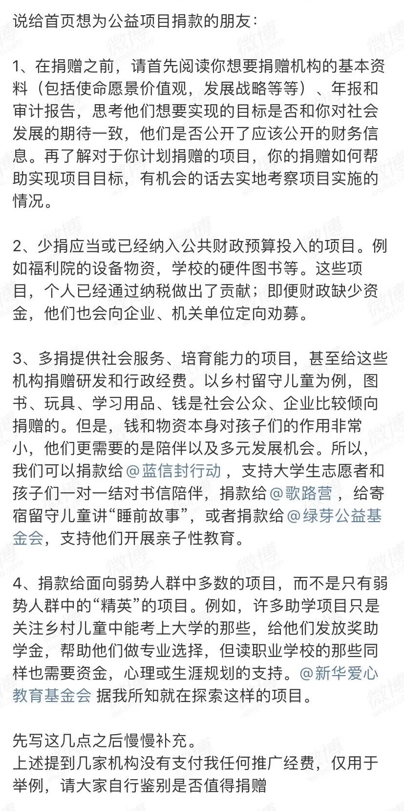

一月是适合做新年计划的时候。对我自己来说，整体计划可能还没有完成，但有一件事我已经确定要做：今年开始，每个月捐 100 块钱。

### 是什么？

说是“捐”，其实除了狭义的捐款捐赠（我单方面交付钱或物给对方，对方并不交付对价），我也用这个概念涵盖了一些“消费”（我用交付的钱/物换取对方的商品/服务等对价），不过这些消费并不是出于投资或者消费的目的，而更多是出于想要支持某种理念，信仰，运动，行为，人物，等（我把这种消费叫做理念消费）。不过为了叙述方便，下面都会用“捐款”这个词涵盖狭义捐款捐赠和理念消费。

### 为什么？

之前我也有给维基百科，流浪猫救助，女童捐助项目之类的捐过款，但都是正好遇到或者正好想起就捐一点，没有把它当作一件持续的事情做。这次想要把它培养成长期的习惯，最直接的原因是我在长毛象上看到了这个网站：



它可以根据你填写的个人收入，告诉你你的收入在全球的排名，以及如果你捐出多少百分比的收入可以帮助多少人和事情。当结果非常直接地摆在眼前的时候，是十分震撼的：

   
 
 
 

我随便输入了 5 万块——对于留在美国工作的我们来说似乎并不算高的一个收入，甚至我也听过一些人觉得这个收入“活不下去”（去知乎一亩三分地之类人中龙凤聚集地，可能更不知道要被说成什么样）。但是它已经超过了全球 98.5% 的人的收入。而如果能够捐出 5 万的 10%，可以拯救 1.5 个生命！

   
 
 
 

对于理念消费来说，虽然可能不会直接地拯救生命或者帮助到弱势群体，但是它也是很有意义的：帮助我们做一个负责任的消费者，用钱投票给自己支持的理念。

我之前听过一期[播客](https://podcasts.google.com/feed/aHR0cHM6Ly9qdXN0cG9kbWVkaWEuY29tL3Jzcy90aGV3ZWlyZG8ueG1s/episode/NWZjMWZkN2ZkZWU5YzFlMTZkMzQ0MjBl?sa=X&ved=0CAUQkfYCahcKEwio1LGz56P1AhUAAAAAHQAAAAAQJA)，说到消费主义社会罢黜了公共意义，消解了个体的公共责任，人被异化为只剩下生理需求，只剩下消费。但是我们也可以反抗：通过审慎的消费，建立自己的购买标准，了解自己购买的东西，把消费作为一种经过反思的手段和工具，一张投给自己想要的世界的选票。

### 为什么是 100 块？

100 这个金额的决定确实是比较主观的。我知道如果我可以捐出收入的 10%，能够帮助到多少人。但是对于刚开始考虑把捐款作为自己习惯培养的我来说，这个比例可能太大，我怕我坚持不下去。所以我希望挑选一个金额，既不会高到我觉得坚持不下去，又不会低到对我无足轻重导致我不太严肃对待。考虑了一下，我觉得 100 /月对目前的我是一个比较舒适的开始。既然是想要做长期的习惯培养，就不需要急着一步到位。像用 i+1 的原则学语言那样循序渐进，比现状进步一点但不要一下挑战太多，能更巩固地让它成为我生活的一部分。

### 你这点钱有意义嘛？

有一种功利论的反对声，认为这种捐款没有意义，对于我想要支持的项目和理念，根本是多我这 100 块不多，少了也不少。反而，我损失了 100 块。那捐了干嘛？

我当然不会指望 100 块可以买来世界和平贫穷消失。100 块对于我想捐款的项目，对于我想要支持的理念，确实是杯水车薪。但是，我们不应该用这样的思路去做决策。不能说只有我做这件事对世界有举足轻重不可或缺的作用时，才去做这件事。只要我们做这件事，确实给世界带来了一点点好处，这件事就是有意义的——every action counts。每一个无足轻重的个人小小的改变，对于最后的改变都是有意义的。我去做这些事，除了实效的考量，更重要的是：做这件事本身就是善的，是对的。

### 这算不算“赎罪券”

在没有完全否定捐款意义的前提下，对于捐款还有一种质疑：捐款是一种个人对于自己的社会义务和道德义务避重就轻“买赎罪券”的行为。想要履行这些义务，不能靠轻飘飘的捐款，而应该做一个实干者，去亲身参加那些项目，去做实际的事情，而不是止步于资助实干者。

首先，如果一个人是可以去一个机构做志愿者，但是她为了省事选择捐款就算了，那这种质疑可能更适合。但是对于一个刚开始了解这些的人来说，有捐款的想法就已经是很好的了。

其次，如果我闭着眼睛随便挑一个地方捐款，买个心安就罢休的话，确实这可能是一种“买赎罪券”的行为。但是如果我为了捐款，做了相当的搜寻，了解新的领域，咨询可得的渠道，认真地对自己的捐款对象进行了解，找到负责人的机构/个人，那对于履行个人义务，是很有意义的！~~女人，不要妄自菲薄！~~

### 所以怎么样进行捐款的决定？

这是我在社交媒体上看到的，我觉得非常有帮助的一些捐款前可以考虑的点。经授权后转载在这里：

   
 
 
 

除此之外，

对我自己来说，我会比较注意的点是：

1. Due diligence: 在捐款之前，要自己做合理的搜索和询问，对想要捐款的项目和项目所在的领域有合理的了解。一般来说，在选择信任并捐款某个项目或者个人之前，我会问自己：
    - 这个项目想要达到的目标是什么，我是否认可？
    - 它做的事情是否有助于达到目的？如果是，它做的事情是否能高效地达到目标？（如果它做的事有帮助但是很低效，我可能会选择能达到相同目的但更高效的项目）
    - 这个项目是否有公开财务收支的信息，以及其他有帮助的信息？（如果一个项目只给到捐款渠道，却没有提供收支明细，我一般不会信任——我不知道我的钱用在哪里，就不知道我的捐款是否有用）
    - 是否有我信任的朋友亲人或者网友对这个项目表示信任？
2. Making it personal: 尽量能让自己的参与多过单纯给钱，自己的了解多过官方信息。
    - 多留意本地的项目，这种项目比一个远在天边的项目更容易亲身了解，它做的事情自己能更容易真实感受到，也方便自己以后亲自去参与。
    - 如果一个项目有我信任的人背书或者至少给出官方信息以外的介绍，我会更容易信任一些。
    

可以谷歌 how to choose a charity to support，也有不少有帮助的信息。

### 我的捐款选择

#### 一月

- 她乡[捐款](https://womenoverseas.com/t/topic/11426)  
她乡对我真的是很重要的地方，我在这里认识了很多很多特别棒的人，也阅读了很多有帮助的话题。能够遇到她乡真的太好啦！

- 绿色蔷薇社会工作服务中心 [捐款](https://mp.weixin.qq.com/s/oZ5wbwqK-ipElO2Tbr3YhQ)  
这是国内专注于给女工和儿童提供服务和帮助的组织，我最开始对它的了解是看了一个对它的创始人的[采访](https://weibo.com/tv/show/1034:4528687895478279?from=old_pc_videoshow)，她们在做的事情是切实地关注流动女工和她们的孩子。可能这不是一个宏大的议题，但是她们把每个女工和儿童当作活生生的人，去倾听和关怀，去给她们一点微光，我深受感动。后来也有朋友告诉我比较可靠，所以我选择了这个。

- HOCC goomomoon [会员](https://goomomoon.com/)  
这几年我一直有阅读立场新闻。苹果走了，立场和众新闻现在也没有了。年前她作为立场新闻相关人士刚被捕又暂被释放。我想向她和像她一样还在坚守的人表达一点支持。我买了会员以后才发现她其实有[捐款的渠道](http://goomusic.com.hk/?page_id=521)。如果有兴趣的朋友也可以直接打钱。

#### 二月

- [新疆受害者资料库](https://www.shahit.biz/cmn/#rss1)   
在毛象看到它已经濒临破产了，需要大家的帮助。是很沉重的话题，我也非常关心，这个月的额度全部放在这里了。

#### 二月底更新：

最近乌俄局势的恶化令许多人都感到沉重。暴力机器的猝然开动是我们无法阻止甚至改变的。这种无力下，捐款也许是我们能做的最容易做到的事情，不仅为了乌克兰的人们，也为了我们自己。
我收集了一些朋友们和媒体列举的帮助乌克兰的捐款列表，整理了一下放在这里，希望对大家有帮助：

在美国纳税者对 **501(c)(3) 组织**的捐款可以抵税，所以会单独列出这项信息供参考。

<u>被多方信源推荐</u>

- **Voices of Children**  
[主页](https://voices.org.ua/en/)  
[捐款链接](https://voices.org.ua/en/donat/)  
The Washington Post (WP), NPR, US Today, Fortune 推荐  
帮助东乌克兰被战争影响的孩子，包括提供生理和心理医生的帮助  

- **Sunflower of Peace**  
[主页](https://www.sunflowerofpeace.com/)  
[捐款链接](https://www.facebook.com/donate/507886070680475/)  
The Washington Post, NPR, Fortune 推荐  
5年前[由一名居住在麻省的乌克兰女性移民设立](https://www.nbcboston.com/news/local/mass-woman-from-ukraine-raises-half-a-million-dollars-for-countrys-relief-efforts/2656068/)）。目前她们在为乌克兰士兵，市民和志愿者提供装有急救品和医疗补给的背包  
**501(c)(3)**: [EIN: 47-2620675](https://apps.irs.gov/app/eos/detailsPage?ein=472620675&name=Sunflower%20of%20Peace&city=Belmont&state=MA&countryAbbr=US&dba=&type=CHARITIES,%20DETERMINATIONLETTERS,%20EPOSTCARD&orgTags=CHARITIES&orgTags=DETERMINATIONLETTERS&orgTags=EPOSTCARD) 

- **Razom for Ukraine**
[主页](https://razomforukraine.org/)  
[捐款链接 1](https://razomforukraine.org/donate/)  
[捐款链接 2](https://www.facebook.com/RazomForUkraine/fundraisers)  
The Washington Post, US Today, Fortune 推荐  
2014 年创建，组织的宗旨是推进乌克兰的民主，“联合” Razom 的乌克兰人民。WP 说她们目前在为乌克兰提供医疗物品；我看了一下主页，有各样项目，目前 Razom’s Emergency Response 这个项目在做的应该就是 WP 说的内容。  
**501(c)(3)**:
有[Annual reports](https://razomforukraine.org/about-us/annual-reports/2020-annual-report/)  

- **Kyiv Independent**  
[主页](https://kyivindependent.com/)  
WP, Fortune 推荐  
三个月前成立的一个英文媒体信息中心，提供了非常多对于这次战事的报道  
目前开通两个 GoFundMe 项目，主要帮助乌克兰国内的目前受到国际关注较少的记者；两个 GoFundMe 现在都已经达到捐款目标  
[链接1](https://www.gofundme.com/f/keep-ukraines-media-going)  
[链接2](https://www.gofundme.com/f/kyivindependent-launch)  

- **CARE**  
[主页](https://www.care.org/)  
WP, Fortune 推荐  
本身是一个国际人道主义组织，现在针对乌克兰危机在进行特别的募捐  
[捐款链接](https://my.care.org/site/Donation2?df_id=31067&mfc_pref=T&31067.donation=form1&s_src=172223UCF000&_ga=2.93900250.612803932.1646072136-1818939984.1646072136)  
**501(c)(3)**: [EIN: 13-1685039](https://apps.irs.gov/app/eos/detailsPage?ein=131685039&name=C%20A%20R%20E,%20Inc.&city=New%20York&state=NY&countryAbbr=US&dba=&type=CHARITIES,%20COPYOFRETURNS&orgTags=CHARITIES&orgTags=COPYOFRETURNS), 有 [Annual reports](https://www.care.org/reports-and-resources/archive/?_resource_type=annual-reports)  

- **Red Cross**  
[关于乌克兰项目的主页](https://www.icrc.org/en/where-we-work/europe-central-asia/ukraine)  
NPR, US Today 推荐  
在乌克兰进行一些人道主义的工作，包括支持食物生产，基建修复，重建家园，对医院学校等提供帮助，等等  
[捐款链接](https://www.icrc.org/en/donate/ukraine)   
这个页面是国际红十字会的，关于税务信息它解释的是在瑞士纳税者可以以抵税  

<u>信任的朋友（及其朋友）推荐</u>

- **Women's Federation for World Peace**
[主页](https://www.wfwp.org/)  
朋友个人捐款的一个 NGO  
整理过程中我唯一看到的**女性 NGO**，目前有一个乌克兰相关[project](https://www.globalgiving.org/donate/31531/non-governmental-organization-womens-federation-for-wor/)：帮助乌克兰难民开始新生活。  
[捐款链接](https://www.globalgiving.org/projects/rehabilitation-programs-for-ukraine-refugees/)  
**501(c)(3)**: 有[Biennial reports](https://www.wfwp.org/biennial-reports)  

- **Nova Ukraine**  
[主页](https://novaukraine.org/)    
捐款链接就在主页显眼处    
朋友的乌克兰同事 personally support 的 NGO 之一  
为乌克兰提供人道主义支持，有各样的项目    
**501(c)3**: [EIN: 46-5335435](https://apps.irs.gov/app/eos/detailsPage?ein=465335435&name=Nova%20Ukraine&city=Palo%20Alto&state=CA&countryAbbr=US&dba=&type=CHARITIES,%20DETERMINATIONLETTERS,%20EPOSTCARD,%20COPYOFRETURNS&orgTags=CHARITIES&orgTags=DETERMINATIONLETTERS&orgTags=EPOSTCARD&orgTags=COPYOFRETURNS), 有 [Annual reports](https://novaukraine.org/2020-nova-ukraine-annual-report/)  

- **World for Ukraine** 
[主页](https://worldforukraine.org/)  
朋友的乌克兰同事 personally support 的 NGO 之一  
由世界各地的乌克兰移民们建立，旨在帮助乌克兰人民度过目前的经济、政治和战争困境  
可以[给这个组织捐款](https://worldforukraine.org/index.php?route=checkout/authorize&info_id=7)  
也可以给为特定的群体捐款：[children](https://worldforukraine.org/index.php?route=information/information&information_id=1), [veterans](https://worldforukraine.org/index.php?route=information/information&information_id=7), [refugees](https://worldforukraine.org/index.php?route=information/information&information_id=2), [animals](https://worldforukraine.org/index.php?route=information/information&information_id=8), [elderly and poor](https://worldforukraine.org/index.php?route=information/information&information_id=10)  
她家主页说捐款是 tax-dedutible ，但没有说明是否是 **501(c)(3)** 组织；我在 IRS 查到应该是这个组织的 EIN 信息 [EIN: 47-3929882](https://apps.irs.gov/app/eos/detailsPage?ein=473929882&name=World%20for%20Ukraine%20Inc.&city=Simi%20Valley&state=CA&countryAbbr=US&dba=&type=CHARITIES,%20DETERMINATIONLETTERS,%20COPYOFRETURNS&orgTags=CHARITIES&orgTags=DETERMINATIONLETTERS&orgTags=COPYOFRETURNS)  

<u>其他被推荐的 NGOs：</u>

（精力所限，以下 NGO 没有详细信息，大家感兴趣可以自己点进主页查看）  

- [WP](https://www.washingtonpost.com/world/2022/02/27/how-to-help-ukraine/)  
José Andrés，DC的一位[以向全世界有需要的人提供饮食著名的厨师](https://www.washingtonpost.com/lifestyle/kidspost/chef-jose-andres-has-an-army-of-volunteers-to-feed-america-and-the-world--some-of-them-are-children/2020/10/06/fbebb774-f92e-11ea-be57-d00bb9bc632d_story.html)，目前有[涵盖乌克兰的募捐](https://donate.wck.org/give/236738/#!/donation/checkout)  
[Save the Children](https://support.savethechildren.org/site/Donation2?df_id=5748&mfc_pref=T&5748.donation=form1)  
[National Bank of Ukraine](https://bank.gov.ua/en/news/all/perekazati-koshti-dlya-dopomogi-zbroynim-silam-ukrayini-stalo-prostishe)  

- [Fortune](https://fortune.com/2022/02/25/how-to-help-ukraine/)  
[Project Hope](https://www.projecthope.org/)  
[International Medical Corps](https://internationalmedicalcorps.org/)  
[The International Rescue Committee](https://www.rescue.org/)  

- [US Toda](https://www.usatoday.com/story/tech/columnist/saltzman/2022/02/24/ukraine-help-support-app-website-donations/6923840001/)  
[Come Back Alive Foundation](https://www.facebook.com/backandalive)  
[Army SOS](https://armysos.com.ua/en/)  
[United Help Ukraine](https://unitedhelpukraine.org/)  
[Revived Soldiers Ukraine](https://www.facebook.com/RevivedSoldiersUkraine/)  

- [NPR](https://www.instagram.com/p/CaawCFSt0UU/?utm_medium=share_sheet)  
UNICEF  
Doctors without Borders  

- [**Help Wounded Ukrainian Soldiers**](https://novaukraine.org/helping-wounded-soldiers/):  
provide medical rehabilitation to wounded Ukrainian soldiers with serious spinal trauma  

感谢小鲸鱼、饿仔、阿奇提供的信息/推荐。  