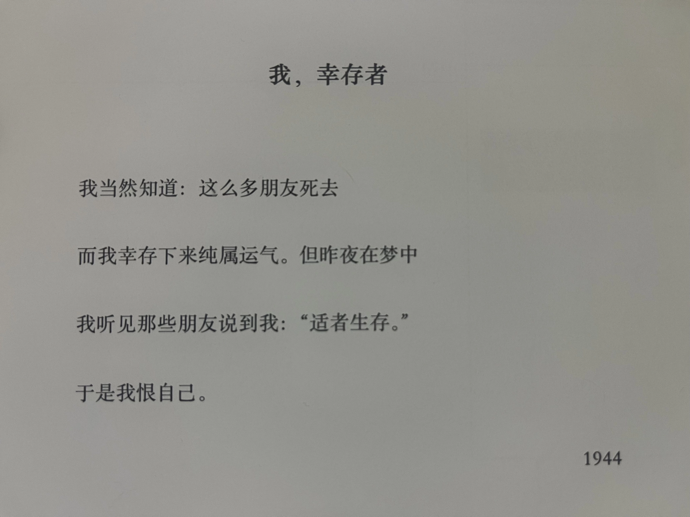
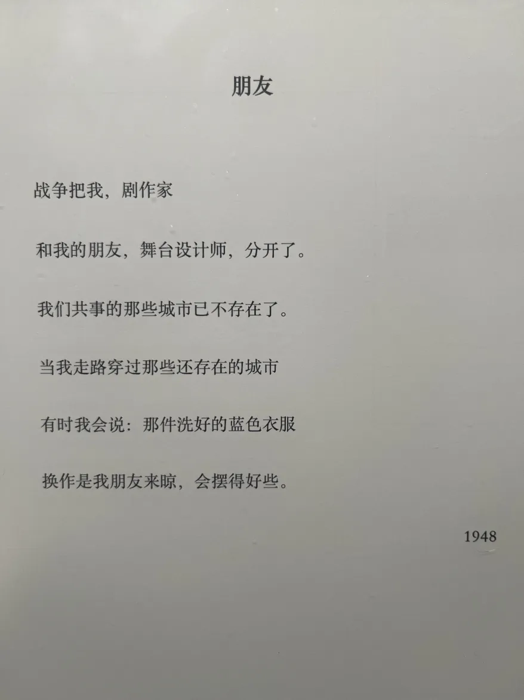

是的，我决定厚着脸皮跳过拖延着的去年 n 个月的月度总结以及年度总结，直接开始今年一月的总结！

## 书籍



2024 年看完的第一本书，一口气读完，感觉蛮奇特的。我一直非常喜欢李安的电影，对他也有几分吃了鸡蛋忍不住去好奇母鸡的心情。这本书确实满足了我的好奇心，李安也算是很诚恳的讲述者，不仅把自己的身世背景真诚交代，也对创作过程非常坦诚。但这本书在解答了一些电影没有给出信息的问题之外，其实也不免破坏了作者和读者之间的界限。也许完整的作品不必作者画蛇添足地额外解释，也许对文艺创作者，还是欣赏作品最好。  



大学时看过，如今全忘了，2023 年再从图书馆借阅，像是看一本新书，但时而有种淡淡的熟悉。有趣的是， 2023 年我也看了一些其它的历史书，大概因为不是这种几千年的通史、又出得晚近，颇驳斥了这本书的一些观点。从不同年代写就的不同的书里看到对同一话题的不同观点，这样的阅读体验也很有趣。但就这本书而言，我不会推荐。它虽然语言非常中国（应该是作者自己亲自润色的中文版？），但内容明显是为了美国（对中国历史没有什么了解的）普通读者而写，很多比喻对本中国读者来说反而有点摸不着头脑。再加上书写得早，我觉得应该会有更适合中国读者的简明的中国通史吧。



一口气看完，真的非常好看。刚开始我甚至以为是作者自传，写得那么平实不做作，闪光的地方动人得那么自然。不过后面能看出是小说。女性意识非常动人，不过看得出来那是年轻一代的女性才会有的觉醒。我非常喜欢！韩国女作家太了不起了！



日本学者写的食物史科普，很容易读，不过对我这种没有相关知识储备的人来说可能只能是走马观花，所以意外地（？）很适合我。虽然只留下了一些碎片但我估计也只能得到一些碎片，比如鞑靼肉排，比如古中国对古日本饮食的印象，大航海怎么影响了全世界，近代科技发展对平民食物的改变等。



似乎是我去年在 Anna’s Archive 搜别的关于女性妊娠终止权的书时顺便下载的，但意外地很有意思。这本书梳理了法国堕胎权的历史，也带到了欧洲背景的堕胎史。翻译似乎偶有难以理解的地方，也可能是我对法国历史背景知识比较欠缺所致。记忆比较深刻的点有：

1. 最开始对堕胎的谴责是出于宗教原因：堕胎使得胎儿失去了出生受洗礼而有资格上天堂的机会；

2. 19 世纪法国卷入战争后堕胎/出生率下降被舆论塑造成了关乎国家存亡的大罪。果然爱国主义是流氓最后的庇护所；

3. 堕胎的流行取代了当时法国乡村还有的杀婴行为。23 年初国内讨论过一阵子我国蔓延千年的杀（女）婴/性别筛选“习俗”，还有过几场各国学者参与的线上讨论会。当时其它国家的学者都表示自己国家历史上并没有这样的“习俗”，我还疑惑为什么。看到这本书说历史中法国也有过杀婴的行为，想来把婴儿视作“人”也并不是自古以来的普世价值；

4. 直到 20 世纪初，法国还禁止孕妇寻求（非婚生）胎儿生父，因为没有亲子鉴定手段，怕女人污蔑男的；

5. 法共搅屎棍！根本不关心女性的权益而只关心堕胎权议题能不能从阶级角度推进。当有女性权益拥护者试图以非阶级论的角度推进堕胎权立法，法共反而诸多阻挠；

6. 马尔萨斯主义者民族主义者法官医生等各方势力在这个议题角力百年，但一直到这几十年女性才得到对这个话题的话语权。在那之前，各方都是出于自己的利益（阶级问题/民族存亡问题/法官的自主权/医生职业的权威，等）在争论堕胎问题，但对这个议题利益最攸关的女性，却一直被沉默着。

总而言之，这本书对于了解“堕胎”这个议题在历史里如何演变，最后成为今天这样，很有帮助。尤其是各方在这个议题里常常诉诸历史、习俗、社会伦理等，而这本书里写到的关于堕胎真正的历史，当时严苛的法律背后又是有怎样（实际上并不属于道德范畴的）实际考量，对我们思考今天的问题也很有启发。



人在痛苦的时候可以借书籍避难；人在灵魂被撕碎的时候，就可以读诗了。这本应该是我去年看到海报上那首《这是人们会说起的一年》后去找的。可能因为时代背景或者语言隔阂，前半本我并没有很多共鸣。但当诗的时间流过作者在战乱里逃亡的年份，客居异乡的年份，这些诗句突然变得太触动人心。

   
 
 
 

   
 
 
 

   
 
 
 

   
 
 
 

   
 
 
 

   
 
 
 



一月看的最糟糕的一本，不推荐给任何人。低配版的《八二年的金智英》，作者笔力不够，但踩热点议题的心又过分明显。凭着几个流量短视频般的情节是凑不成一本有意义的小说的。本来“激进女权主义者，但是异性恋”这样的设定是有非常多且深刻的东西可以写，然而作者隔靴搔痒地罗列了几个网络爆点式情节、莫名其妙的性相关情节之后，什么也没说清楚。没有一个人物是活的，全都只是演出流量热点的工具人。这本可以很明显地让人感受到为什么说人物才是小说的核心而不是情节。

## 音乐

