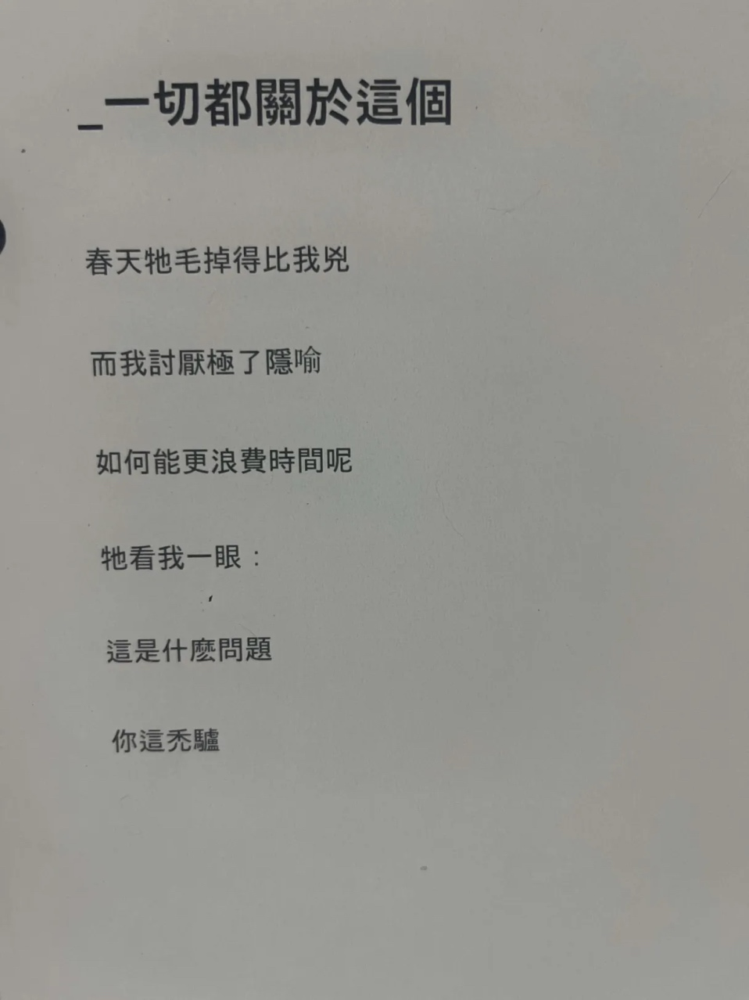

二月短暂，但出乎意料，我这个月竟然做了不少事情：把个人博客从 notion 迁移到这里，看了好几本书，还通关了三个游戏。值得夸夸我自己。

## 书籍

### 已读



有生之年，我竟然把这本来自耶仔读书会的 2021 年阅读书目看完了。我一度以为按我三天打鱼两年晒网的进度，此书得写进遗嘱托付给我的孙女接着看了。不过，还好我亲自看完，否则错过这样一本好书真是死不瞑目。

这是一本为性工作者权利主张和辩护的书，它的特点，一是兼具了清晰的逻辑和易读的语言；二是，它是由性工作者本人写的，有更主体性的视角，而不把性工作者当作单纯的被动的“研究客体”、抽象的学术概念，抑或需要“解决”的“问题”。

我们常常置身事外地讨论，被抽象的概念或高高在上的价值所吸引，而忽视议题下被影响的活生生的人的处境。不幸的是，这在人们讨论性工作的时候，太过经常发生。作者在书中也具体地反驳了好几种这类论调，包括把性工作当作女性解放的、无视了性工作这个行业的父权和剥削属性的鼓吹，和把性工作者当成剥削女性性资源的帮凶而要求惩罚。两者实际在讨论这个议题时候，都把性工作者们真实的处境和需求置于自己的政治主张之后，这是作者所批评的。

本书也详细地分析了几种主流的针对性工作的立法模式的实际执行情况优劣，让读者了解到每一种立法模式除了它响亮的听起来正确无比的理论口号以外，在把理论转为法条、在把法条从纸面实施到现实的时候，会产生哪些问题，尤其是给性工作者们造成怎样的困境甚至苦难。

特别让我印象深刻的一点是，作者专门用一章的篇幅论述了现代的国家边界管制和移民系统是如何极大程度地恶化了性工作者的处境，尤其是 sex trafficking （应译为“性贩运”？）问题。在全球极速右转、各国都在把移民当替罪羊宣泄恶意的当下，这一章的批判更有现实意义。

上面的几段我写了很久，因为懊恼于怎么写都表达不出原书的好。我现在想通了，读后感只能非常片面地表达我看完当时的感受，本来也写尽原书的好处，除非我写本一样的书。所以如果看了前面的内容觉得也就一般，那是我的问题，绝不是这本书不好。总之，强烈推荐！



又是一本有生之年。这本是法学大家德沃金对堕胎权和安乐死的讨论。大学者的文字读起来真是酣畅淋漓的脑力锻炼，逻辑缜密，论证严谨，复杂的问题在他笔下被抽丝剥茧地观察和分析。尤其是堕胎这个话题，在美国的语境里，牵扯了太多宗教政治等利益瓜葛，因此格外纷繁芜杂。作者一把剃刀把枝节的庞杂剔除，点破拥护者众多的论调的逻辑不自恰和口不由心，揭露拥护者真正的逻辑，然后从一个能够兼顾双方的切入点构建更好的分析路径。我现在还记得我第一次看的时候那种拨云见日的爽快感！

不过，我不认为这是一本适合大众的书。它毕竟还是偏理论，阅读最好要有相应的法理学基础；另外，这本书是以美国的判例和国情为中心的。而实际上美国并不是个多值得参考的民主国家，对于堕胎、安乐死这种涉及宗教的话题，美国更是保守得近乎无理可讲。对各国都很不幸的是，由于美国在人类社会里远超于其实际价值的存在感，美国的各种东西都吸引来它配不上的注意和认同，导致许多本来非常“美国特色”的问题蔓延成了全球的问题（堕胎问题到今天还如此有争议，本身就是美国的落后价值贻害各国）。

另外，这本书的中文翻译（我看的是郭贞伶、陈雅汝译本）不能令人满意，使本就复杂的书读起来更雪上加霜。“Constitutional checks (and balances?)”被翻译为“宪法检验”，法律解释的“originalism”被译为“原创主义”（更准确的翻译应该是原意主义或原旨主义），“the right to beneficence”成了“慈善权”（更准确的翻译应该是受益权，是受益人享有的、和对受益人负有义务的人应尽的义务相对的权利）……简直匪夷所思。所以我不知道中译本到底多大程度反映了作者的原意。我想我有时间会去重新读原版。



阴差阳错地，我前几年先看了《鼠疫》，而最近才看了《局外人》。屁老师告诉我，其实事件发生的顺序是反过来的。不过对阅读本书倒没有影响。

看得出来，作者刻意把主角索尔默塑造得不讨人喜欢，甚至已有点令我生厌。他感情淡漠，对道德亦无强烈感受，不过他也并不试图对此有所矫饰。如作者自序所言：

> 在现行社会，倘若某人没在母亲葬礼上哭，便有被处死的风险……索尔默不愿撒谎。撒谎，不单单意味着说些不存在的事。撒谎，更是指，甚至尤其是指，说的事超过了真实存在，具体到人心层面，即是指所说之事超过了自己所感受到的。

不说超过自己所感受到的，这个诚实的标准之高，已经是非凡的勇敢了。难怪加缪都说，主角是“the only Christ we would deserve。”

我应该会再看一遍《鼠疫》。



微信读书听完又一本。浅显易懂的流行病与人类历史的科普读物。比起生物学，它更偏向历史。不过它是以不同的传染病划分章节，介绍每一种在人类历史中（尤其是西方历史中）产生过重大影响的传染病的来龙去脉、病理和对人类历史文化的影响。很有意思，值得一读。



萨福诗选。这个月读书会的主题是女诗人的诗歌，所以我额外看了这本。我这浊物看得不是很懂，但有几首确实让我觉得很有意思。读书会有朋友推荐了[另一个译本](https://book.douban.com/subject/1808174/)，我有时间也想读一读。



这个月因为我迷上了游戏《孤山独影》，所以看了同样是独攀题材的、据说游戏多有借鉴的这部漫画。它改编自以日本传奇登山家加藤文太郎为原型创作的小说。漫画讲的是主角森文太郎从高中阴差阳错第一次接触攀岩开始，被攀岩所吸引，立志独攀世界级险峰 K2，到自己整个人生都被攀登攫走的故事。

我很喜欢这部漫画。它不仅是一部运动主题的漫画，更是关于人如何面对孤独，人怎样追寻自己人生意义的作品。主角一直性格孤僻，习惯远离人群，唯有在山中独自攀登的时候才感受到自己的存在。他是在雪山中迷路后，寻路到筋疲力尽，走到能看见山下城市灯火的时候，会心生恐惧而转身向深山走去的那类人。他不需要文凭或工作前景，拒绝所有社交，全部的人生都献给自己攀上 K2 的梦想。我非常羡慕他。

漫画的画风很精致，分镜非常非常好，很多地方让人感叹这样的表现非得漫画这种体裁不可。主角深夜独攀，仿佛踩着流星策马在群星间奔驰；清晨独自在雪山醒来，迎着日出徒步，仿佛置身恢弘的交响乐……这些绮丽比喻在漫画里被呈现得实在贴切生动。非漫画不可！在一些意识流的桥段，漫画也表现得如诗般梦幻。

不过也有需要预警的不足之处，也是日本漫画通病：对女性刻画的苍白甚至落后，甚至剧情都充满男性小头占领大头的凝视（描写男性堕落可以是成了沽名钓誉的骗子，女性堕落就非得是主动出卖肉体……还有为了表现攀上封顶的巅峰体验，非得用男女交媾做比喻──我说，这也太土了！除了性那点事，咱能多点想象力吗！）。如果对这一点不耐受的话，我不建议你去看。



这本书是我在微信读书听完的。作者基于清代刑事案件对清代法律制度的历史普及文集，算是兼具学术作品的严谨和通俗读物的易读，读来令我开了不少眼界。之前我所了解的清代法律制度，都是抽象的概括和既定的结论，像是中学课本讲的历史。这本书的优点就在于，它以具体案件为基础展开，使人有更真切的了解，不会失之于笼统。它所论及的也是相对具体的现象或问题，比如，因为制度上严厉处分无法限期侦破强盗案的地方官员，实务中刑侦技术有限，财政上大案办理成本极高常造成地方经费亏空，导致清代时有官员将强盗案诬陷于无辜的受害人亲属的“诬良”之举。上编的每一篇文章，都是从一个具体案件开始。等读者有了初步了解，下编便浅白地介绍更多系统一些的知识，比如情敌刑部审理案件的流程，刑部书吏在明文的法律和制度之外的灰色空间里的权力。总之，我听完学到了不少，推荐。



在微信读书听完的。打发时间的话尚可一听。

顾名思义，这本书主要是讲手机如何影响我们的大脑。如果对于相关话题已经有所了解，这本书就是比较浅显的老生长谈了。否则的话，这本倒不失为不错的科普。最近的几百年人类的生活方式产生了巨变，而人类的大脑还停留在原始的生活方式，并不能适应这么大的变化，尤其在智能手机引领的信息爆炸、注意力被争相抢夺的时代，我们的原始大脑更是无力招架。多任务模式和大脑默认设置的冲突、仅仅是存在就可以偷走人的注意力（即使我们只是把手机放在一旁不去碰它）、习惯依赖电子输入和存储使我们更健忘、手机时间会损害睡眠、还有 SNS 的泛滥对人生理和心理健康的负面影响……这些读起来都很使人警醒。这本书没怎么提出解决方法，运动算是一个。让我窃喜的是，书里说，即使是稍微活动身体几分钟，也能对增强注意力、提高大脑处理信息速度有帮助。这可真是对我这种退堂鼓演奏选手、启动特困户的大好消息。每天至少稍微活动几分钟，好像就连我也可以做到！



豆瓣的一条短评非常精准地概括了我的感受：很难看，但是不忍心给差评。

这本书写的是作者自己的（母亲的）故事（我不想用“故事”这么轻的词，但一时找不到更好的词代替），而这故事又十分沉重，因此我很难忍心从写作的技术层面给负面评价。但是，这本书写作的技术层面又确实给我的阅读带来负面感受。故事本身很有写和读的价值，关于那个年代意大利女性的出走和绝境。但不幸的是，作为母亲的故事一部分的亲历者，作者对自己的母亲并不比我们知道的多。作者写这本书是为了寻找母亲，在稀少的证据所不能至之处，她加入了很多很多她自己的抒情和想象，还有过于详细的时代背景描写。作为母亲的女儿，我无法责怪她把陌生的至亲的故事写成了这样；作为读者，我也无法推荐其她读者阅读这一本书。

### 弃读



起因是我在豆瓣看到了一个 [ rage-bait 的帖子](https://www.douban.com/topic/475290615/)，大意是说，任何读书博主年阅读量 300 本只是门槛，如果一个人年阅读量小于 200 那么抱歉你的阅读感想欠缺参考价值云云。虽然很明显这个帖子是为了流量故意激怒读者，但阴差阳错让我想要捡起原博主口口声声推荐的《如何阅读一本书》来再看看。

上一次我尝试看这本书是十多年前了，我甚至已不记得看完没有，估计是没有。这次捡起来重新看，却很快就后悔了：作者故弄玄虚地把略读的技巧说得毫无必要地深奥麻烦。作者并不是在为读者服务的工具书，而是在展现和满足自己。看到一半我实在是看不下去了，也难以理解这本书何以被那么多人推崇。如果想要学习略读，实在不必折磨自己看这本书，找一个英文应试的阅读方向的教辅，比这说得清晰明了多了。



我都忘了为什么要看这本，很可能是因为它迷惑性的书名。《我们如何捍卫私人生活》，我一厢情愿地以为这是讲如何在当下社会捍卫自己的精神自主或者是生活隐私，也许还能看到一些有深度的对我们习以为常的资本主义生活方式的反思和诘问。

翻开书，看见洪晃作的序我就应该警铃大作的！可是我真傻，真的，想着要给书一个公平的机会，竟然努力看了两章。结果又是熟悉的美国畅销书味道——塞一大堆具体的案例来凑字数，一会南希这样一会艾米莉那样，我不禁发出天问：美国畅销作家是小时候看奥曲轻减肥广告看多了吗？什么 Mary 十天想减十二斤，Lucy 减肥还想照吃照睡，Lisa 减肥只想减一条腿……而这本书的烦人程度完全不逊于奥曲轻。前几章全都围绕着传统异性恋社会的相亲结婚那点事情极尽鸡毛蒜皮，半点理论深度都没有就算了，到底是谁想看有钱人请相亲顾问婚礼策划的案例 ABCDE 然后慨叹有钱人把杂事都外包了失去了私人生活……我赶紧彻底删除，并以酒精消毒 Kindle 去去晦气。之后三个月我要是再允许自己读超过十五分钟的性缘社会鸡毛蒜皮，天厌之，天厌之！



我又又又又又被书名骗了。《如何阅读一本书》的作者恐怕此时要发出诅咒冷面的假笑：叫你不看完我的书，又栽了吧！

但是我有理由辩护：这本书的序写得太好了，成功迷惑了我。然而事实上，正如一些书评说的那样，这本书仅有的看点就是序一和第七章。序一总结了中国传统修史只注重记述统治者而忽略被统治者之弊。如果不是统治阶层的官之功过需要臧否，则被统治的民的苦难几乎难以入史。这本书号称不用宏大叙事，也避开统治者思维，从史料中挖掘当地普通人的境况，因此吸引不少读者，也包括我。但是实际阅读令人大失所望：作者只是基于明清时期的当地县志进行（专业性成疑的）发挥，实际讲的还是王侯将相的那些事情，仅第七章着眼在了“民”。要说这种“挂羊头卖狗肉”，《漫长的余生》其实也是类似，营销着普通人的微观史，其实还是写肉食者故事。但《漫长》比这本好看、扎实太多了。所以不推荐。



俺看不懂。

  
 
 
 
  

## 音乐

二月我甚是痴迷了一阵子 Suno。不过在摇了一阵子筛子以后，我对 suno 的探索停在了把 Bread and Roses 转成中文歌的尝试上── AI 技巧远胜人类，但在情感上目前还差得太远。

因为玩 suno 需要找歌曲参考风格，阴差阳错我又听起了王菲（千禧年前后的）。整个二月我几乎在单曲循环她的《不眠飞行》，并且感叹怎么还有遗珠！真是君生我未生，我生君已经去唱红歌了，遗憾呐！

  <iframe width="380" height="380" src="https://www.youtube.com/embed/j6uWtXyN63o?si=LVumHK_voWSNv668" title="YouTube video player" frameborder="0" allowfullscreen></iframe>

## 游戏

二月份我甚至非常勤奋地通关了三个游戏：《Cairn》《奥伯拉丁的回归》以及《鲁特里一家死了》。这大部分得益于我加入了某老师的 steam 之家，瞬间坐拥上百款游戏（含一些 gay 向黄油，默默看向某老师）。这三个游戏我都十分喜欢！

 

---
这一篇写得十分缓慢吃力，主要是因为我开始学习和适应双拼，打字速度堪比蜗牛，有时候急躁于词不达意，气急败坏地扔开文档不管了。还好，我最终还是靠自己的毅力完成了本篇。希望下个月我的双拼熟练度能多多提升！