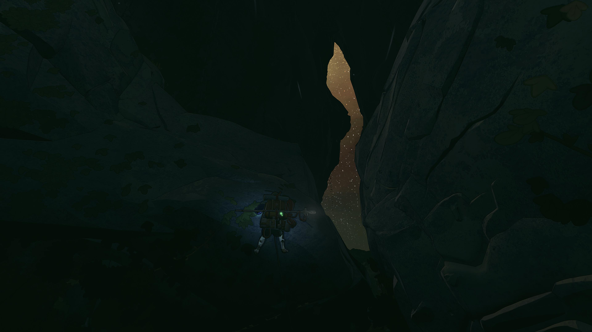
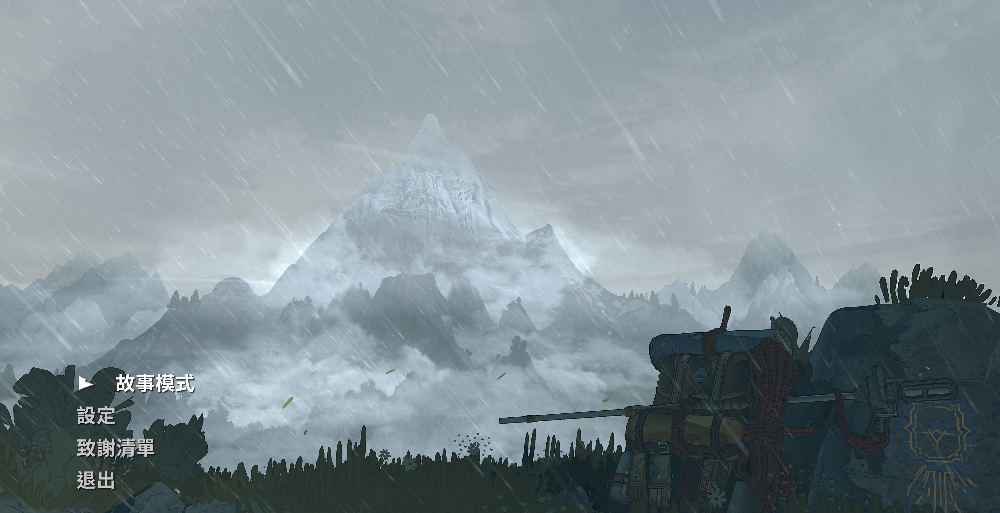
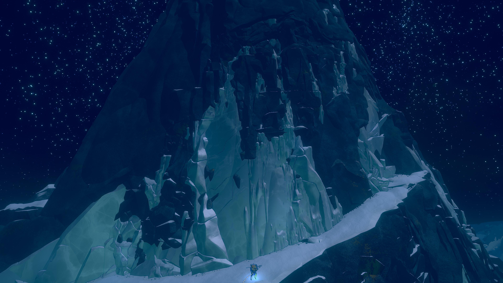
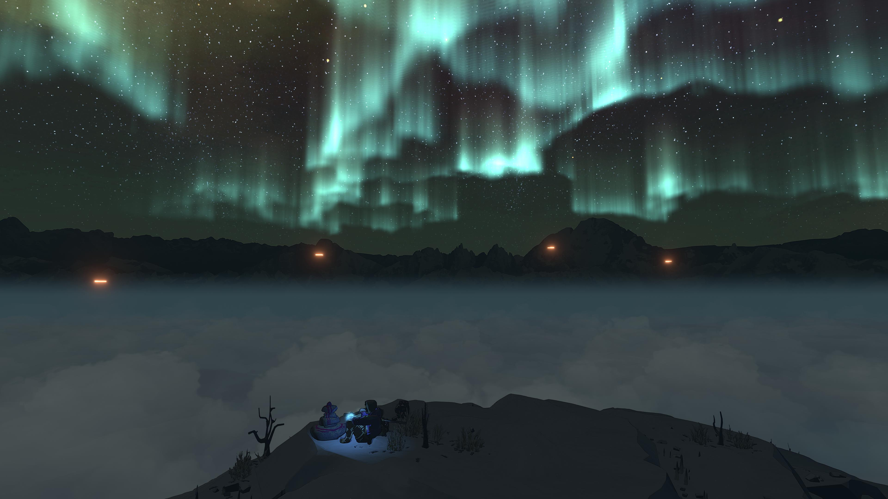
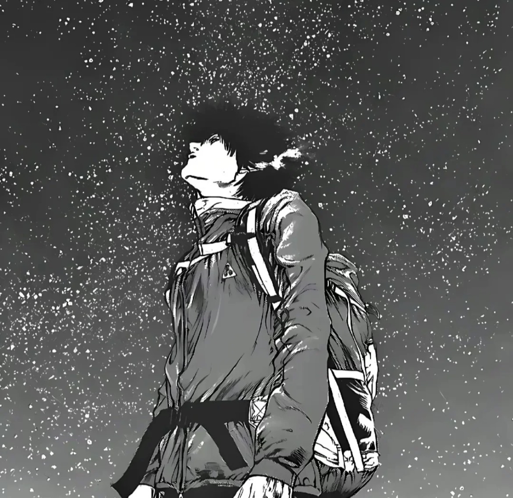
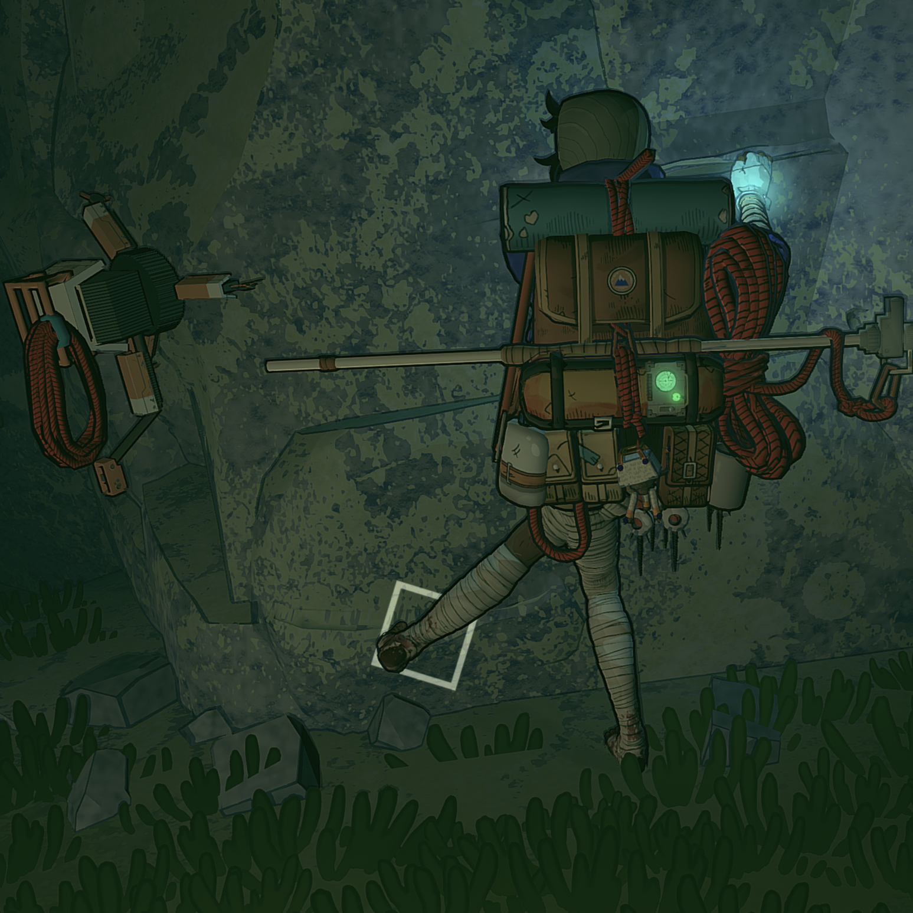

> **内容预警：**
> 本文有提及游戏画面、剧情元素等。我打码了对关键情节的直接剧透，但仍可能有间接提及。介意的朋友可以通关后阅读。

二月初，我通关了 Cairn。我非常喜欢，想把它推荐给更多人。这是我近期玩到的最喜欢的也是沉浸感最强的游戏之一。（预先说明：我玩过的游戏并不多。）中文译名《孤山独影》，翻译得非常精准。这是一个追求“触碰永恒”的攀岩家独自登顶神之山的故事。

游戏的主要玩法很简单：控制主角的四肢在一切可以攀爬的地方向上爬直到登顶神之山，加上一点一些探索收集元素，比如参观原住民群落遗迹，沿途收集纪念品、特殊道具，以及管理背包物资。

## 沉浸感

游戏听起来可能比较单调，但实际上手很容易就能沉浸进去，有时候甚至会在紧张的时候忘记呼吸。部分是因为游戏系统里不显示很明确的相关数值，比如没有耐力条，玩家只能通过女主直接的反应（耐力马上耗尽时她会手脚颤抖、呼吸急促，甚至整个画面会变暗）确定这一步移动得是否有效。这种软性引导的效果是，我更多时候不会感觉是我在玩一款游戏，而感觉是女主真真实实地在爬山；而我爬着爬着，发现自己在不知不觉中变强了，很有成就感。另外，和女主一起攀岩，也有一种在进行回合制策略游戏的感觉：我们需要一步步计划最佳策略以成功攀到下个可休息的平台；下一步是稳扎稳打，还是要冒险拼一把；要不要在这里用掉一颗岩钉；要不要喝掉最后一口水……每次爬上一个平台可以喘口气时，往往我才意识到之前攀爬的一路我完全和女主合二为一，沉浸在心流之中。

## 美术、音乐和演出

 

这款游戏的美术风格非常赏心悦目。这是我非常喜欢的卡通渲染的风格，人物塑造虽然比较简化，但景物却十分精美。虽然有句话已经被滥用，但放在这里没有半点夸张：“随便一张截图都可以做壁纸”。游戏也有这种自信，专门设置了摄影模式，方便玩家调整各种参数拍出更好看的壁纸；游戏里也设有不少观景点，可供玩家停下欣赏景色，享受禅意的瞬间。

 

游戏的音乐非常贴合游戏的情景，在恰当的时机进入，对于游戏极佳的代入感功不可没。有时候我费尽九牛二虎之力，攀过险峻的悬崖，爬上了山腰一处绿地，刚有“柳暗花明”之感时，音乐的哼唱也适时响起，使我紧张的心瞬间平静下来，好像也能感觉到有风拂过攀岩家伤痕累累的手臂，她在自然的凶险和宁静中得到了完全的接纳。

  <iframe width="380" height="380" src="https://www.youtube.com/embed/J4Q416K8JWQ?si=WFteuvzy7yaOYBBL" title="YouTube video player" frameborder="0" allowfullscreen></iframe>
  

    这个游戏我最喜欢的配乐之一。
  

游戏的演出也让我印象深刻。游戏序幕结束的开场演出，简直是我近年来玩过的最印象深刻的演出之一，可以和《博德之门3》中艾琳女士被释放时的演出带给我的震撼相媲美。游戏结局的演出也让我大受震撼： 虽然刚开始有一点摸不着头脑，觉得何至于此；但随着我打开二周目，发现游戏的首尾呼应之处，又再消化了好几天，我终于慢慢理解了那种诗意的、浪漫的、不顾一切的极致。

  
## 不讨喜的女性，不隐藏的女同

前面提到，游戏对人物的建模相对简化，甚至不少玩家抱怨“丑”。但这反而是我非常喜欢的一点：没有好看的义务。女主何止外貌并不用心在“好看”，性格也相当不讨喜。她执拗、孤僻、骄傲，脑袋里只有登上山顶这一件事。我不一定喜欢她，但是我很喜欢她的存在。她不需要讨喜，只需要有能力和毅力继续攀登。

相似的道理，我也非常喜欢游戏里的女同情节。简中游戏圈谈 LGBTQ 色变，导致我看到的游戏主播提到这个游戏里女主的同性恋人时只敢含糊其辞地称“闺蜜”。那么我偏要强调，还要放在标题里——女同，女同，女同！这个游戏是正儿八经 LGBTQ 游戏，主角是 100% 真女同！

有反对者说，女主设置成女同还是直女对游戏根本没什么实质影响，非要弄个女同元素只是在蹭 LGBTQ 的“政治正确”罢了。我对这种“默认顺直”的论调已经非常厌倦。凭什么非顺直的角色和情节只有在绝对“必要”的时候才能存在？仿佛只有涉及变态连环杀手才会想到跨性别者，只有被老公家暴到对男人恐惧才能变成女同（说的就是你，《伪装夫妇》）……只要不加深负面的刻板印象或者歧视，“没必要但是可以”地加入 LGBTQ 元素又有何不可。既然是直女或是女同不影响游戏，那为什么不能是女同呢？

## 触碰永恒，与世界融为一体

另外让我印象非常深刻的就是女主角对攀岩的执着。这份执着已经远远超过了热爱，而成为了她人生最大（如果不是唯一）的追求。起初，我并不太理解她的孤僻、执拗、不近人情。我的想法和游戏里的马可比较像：如果我能攀上山巅，那自然好，如果登不上，我就下撤，回去过我的生活。总还有下一座山，下一次攀登。游戏也没有对这份执着给出解释，只是展现了执着的结果：她不接经纪人的电话、抛下了生病的家庭成员、在前辈用生命安全劝阻的情况下仍一意孤行……以至于在结局时，我一度难以置信：这又是何必？对我来说，登山时的死亡，不能叫“献出生命”，而是“发生事故”。没有了生命，又怎么能继续攀登？我只能用隐喻来理解剧情：这并非字面意义地为了攀上山巅而献出生命，而是隐喻为了自己生命的意义燃烧付出，是“朝闻道，夕死可矣”的具象化展现。

不过，后来我看网友提到，这游戏可能受到漫画《孤高之人》的影响，而去看了漫画之后，更能够理解女主了。女主像极了漫画主角，是那种讨厌人群，独自在深山里才感到自在与平静的人。漫画里对主角的性格有了更详细的刻画，也对独攀的魅力有更多篇幅的震撼展示。它说服了我：女主独自攀岩登顶，并不是单纯的隐喻，而确实是代表了一些人真实的毕生追求。她们是可以在极端恶劣的环境下，在人类生命的极限里，在自然的和善与残酷两极转换之间，如女主所说地，“在某个瞬间，触碰到永恒，与世界融为一体”。俗人如我还能说什么呢，只余深深的敬佩与羡慕。

  

    《孤高之人》我也很喜欢。不过如果对日本漫画向来的女性刻画方式不耐受的话，我不推荐去看。
  

## 游玩建议

这个游戏初上手难度颇高（至少对我来说）。光是教学关岩馆里的几条线就花了我好长时间，挫败感很强。再加上每次滑落后女主都会大声抱怨甚至咒骂，也增加了挫败感。因此我会建议不想因为难度影响游玩体验的朋友：

1. 一周目先选择最简单的“探险者”模式。这个模式主要会更频繁地存档，并且提供时间回溯功能：玩家滑落时可以回溯到掉落前，重新选择自己的动作；

2. 在设置-游戏里打开“支点反馈（holds feedback）”。开启后，女主四肢抓到不易力竭的稳固着力点时，画面会出现一个正方形作为反馈。一般来说，四肢有两个点（尤其脚）在稳固着力点上，就不太需要担心滑落。这个游戏对攀爬点的判定不太准确，有时候看起来已经抓到一个着力点，但其实游戏判定是没抓到。打开支点反馈能帮助新手更直观地看到是否判定成功；

3. 攀爬的姿势尽量贴合实际攀岩姿势。虽然女主的身体柔韧性高得可怕，使得女主可以以完全违反人体生理结构姿势攀爬——我认为这是尽可能拓展玩家自由度而刻意为之的设置而非游戏缺陷——不过玩多了会发现，能够以“扭曲”“不自然”的姿势长时间攀爬的地方，正是难度并不高的线路。实际上，女主的姿势越符合真实攀岩的姿势，攀爬起来越省力高效，不容易滑落，尤其是面对难度高的线路。比如，女主四肢舒展伸直的姿势比起长时间弯曲更省力；当姿势的重心比较稳定时候，女主也不容易力竭，等等。

另外还有一些零散的建议：
- 对于和我一样的，每个空罐头都要捡走、背包常年爆满的仓鼠型玩家，如果你还没有发现，请务必多多摇晃你的背包，等到背包里的物品被晃沉下去、上层露出空隙的一瞬间关闭背包并火速捡起你心爱的小垃圾，你就会发现原本“背包已满”的提示不见了，而小垃圾已经成功收入囊中😊
- 如果你获得了晴天娃娃，请不要像我一样“咦这是什么按一下‘使用’；咦这是什么按一下‘使用’；咦这是什么按一下‘使用’；咦我娃娃呢？“……它有使用次数限制，似乎是三次。请务必留一次到游戏接近结尾处😢
- 最后，离开最后一个存档点之前，多带点水！你能明白一个独立大女主在满地积雪漫天飞雪的雪山竟然沦落到差点被渴死的绝望吗！

最后，希望你玩得开心。

---
## 备注

我最初是从 up 主小米米沙的这个视频里知道的 Cairn 这款游戏。如果你想看游戏试玩和视频形式的游戏推荐，相信这个视频比本文更直观详细：

  <iframe width="560" height="380"src="//player.bilibili.com/player.html?isOutside=true&aid=115924153669643&p=1&autoplay=0" scrolling="no" border="0" frameborder="no" framespacing="0" allowfullscreen="true"></iframe>
